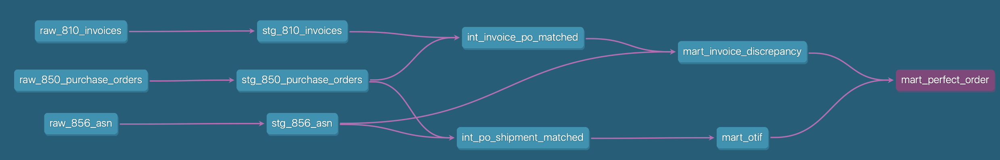

# EDI Order-to-Cash Analytics Engineering Portfolio

An end-to-end Analytics Engineering project built on real-world EDI (Electronic Data Interchange) supply chain data. Demonstrates production-grade dbt modeling patterns, KPI derivation from raw EDI transaction sets, and a fully tested transformation pipeline on Google BigQuery.

---

## Business Context

Retailers and suppliers exchange EDI documents to execute the order-to-cash cycle:

| EDI Document | Transaction Set | Purpose |
|---|---|---|
| Purchase Order | **850** | Retailer sends order to supplier |
| Advance Ship Notice | **856** | Supplier confirms shipment details |
| Invoice | **810** | Supplier bills retailer for goods |

This project ingests all three transaction sets, joins them across the supply chain lifecycle, and produces KPI marts used by operations and finance teams to monitor supplier performance and invoice accuracy.

---

## Architecture
**Full project lineage DAG:**



**Layer responsibilities:**

| Layer | Materialization | Responsibility |
|---|---|---|
| Seeds | CSV → BigQuery table | Raw EDI transaction data (850, 856, 810) |
| Staging | View | Type casting, column renaming, data quality flags |
| Intermediate | View | Business logic joins across EDI document pairs |
| Marts | Table | KPI computation, analyst-ready grain |

---

## KPI Definitions

### OTIF — On Time In Full
A shipment is OTIF if **both** conditions are met:
- **In Full**: `shipped_qty / ordered_qty >= 1.0` (fill rate = 100%)
- **On Time**: `ship_date <= requested_ship_date`

Grain: PO line level (`mart_otif`)

### Fill Rate
`fill_rate_pct = shipped_qty / ordered_qty`

Measures the percentage of ordered quantity that was actually shipped. Range: 0.0–1.0.

### Invoice Discrepancy Rate
An invoice line has a discrepancy if:
- **Price discrepancy**: `invoiced_unit_price != po_unit_price`
- **Qty discrepancy**: `invoiced_qty != shipped_qty` (compared to ASN, not PO)

Grain: Invoice line level (`mart_invoice_discrepancy`)

### Perfect Order Rate
A PO is a Perfect Order only if **all lines** meet all three conditions:
- OTIF = true
- No price discrepancy
- No qty discrepancy

`perfect_order_rate = COUNT(po where is_perfect_order = true) / COUNT(all POs)`

Grain: PO level, rolled up via `LOGICAL_AND()` (`mart_perfect_order`)

---

## Tech Stack

| Tool | Purpose |
|---|---|
| **dbt Core 1.11.7** | Transformation framework, testing, documentation |
| **Google BigQuery** | Cloud data warehouse (dataset: `edi_order_to_cash`, region: `asia-southeast1`) |
| **dbt-bigquery 1.11.1** | BigQuery adapter |
| **dbt_utils 1.3.0** | Extended test library (`accepted_range`, `unique_combination_of_columns`) |
| **GitHub** | Version control (SSH auth) |
| **Python 3.12.13** | Runtime (via pipx) |

---

## Project Structure
---

## How to Run

### Prerequisites
- dbt Core + dbt-bigquery installed
- GCP project with BigQuery enabled
- `~/.dbt/profiles.yml` configured with OAuth

### Commands

```bash
# 1. Install dbt packages
dbt deps

# 2. Load seed data into BigQuery
dbt seed

# 3. Run all transformation models
dbt run

# 4. Execute full test suite
dbt test

# 5. Run everything in one command (seed + run + test)
dbt build

# 6. Generate and serve documentation
dbt docs generate
dbt docs serve
```

---

## Test Coverage

**28/28 tests passing across all layers.**

| Layer | Test Type | Count | Details |
|---|---|---|---|
| Staging | `not_null` | 10 | Key columns across stg_850, stg_856, stg_810 |
| Staging | `unique_combination_of_columns` | 3 | `po_number + line_number` grain enforcement |
| Intermediate | `not_null` | 4 | Flag columns on both int_ models |
| Intermediate | `accepted_range` | 1 | `fill_rate_pct` between 0 and 1 |
| Marts | `not_null` + `unique` | 7 | Key flag columns + PO-grain uniqueness |
| Singular | Custom business rules | 3 | Fill rate cap, no negative invoices, price variance direction |

---

## Seeded Discrepancies (KPI Validation)

Intentional data issues embedded in seed CSVs to validate KPI logic:

**OTIF failures:**
- `PO-1002`: Shipped 195 vs 200 ordered (97.5% fill rate), shipped 1 day late
- `PO-1004`: Shipped 240 vs 250 ordered (96% fill rate), shipped 1 day late
- `PO-1005`: Delivered Jan 20 vs Jan 19 requested (1 day late delivery)

**Invoice price discrepancies:**
- `PO-1002 Line 2`: Invoiced $5.75 vs PO $5.50
- `PO-1004 Line 1`: Invoiced $4.50 vs PO $4.25
- `PO-1005 Line 2`: Invoiced $21.50 vs PO $21.00

**Expected KPI outputs:**
- OTIF Rate: 3/5 POs OTIF (PO-1001, PO-1003 clean)
- Invoice Discrepancy Rate: 3 price discrepancy lines flagged
- Perfect Order Rate: **40%** (2/5 POs fully clean)

---

## Author

Alowina Peralta · [github.com/apera77](https://github.com/apera77)
